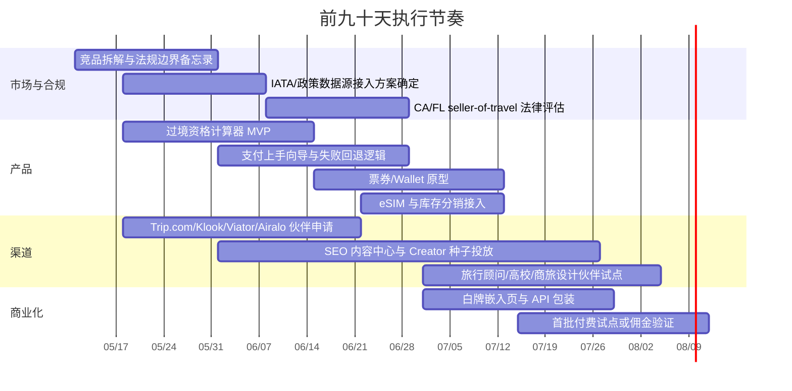

# 面向赴华西方游客与赴美中国游客的线上旅游竞品深度研究

## 执行摘要

本报告以“**只做线上/技术，不做境内接团、地接执行、包团带队**”为前提，评估已有 online/web/app 竞品，以及创业者还能切入的空白。结论很明确：**市场并不空白，但仍然高度碎片化**。按 entity["organization","国家统计局","statistics china"]数据，2019 年中国入境游客为 1.4531 亿人次，其中外国人 3188 万人次；到 2024 年恢复到 1.3190 亿人次，其中外国人 2694 万人次；2025 年进一步升至 1.5450 亿人次，其中外国人 3517 万人次，意味着总入境与外国人入境都已超过 2019 年水平。全球层面，entity["organization","UN Tourism","tourism agency madrid"]估计 2024 年国际游客已恢复到 2019 年的 99%，entity["organization","国际航空运输协会","air transport montreal"]则称 2024 年全球航空客运量已比 2019 年高 3.8%。这说明“赴华外国散客数字工具”不是在赌复苏，而是在追逐已经发生的复苏。citeturn42view2turn43view1turn33view0turn33view1turn33view2

但现有线上产品的解决方式是“**分层补丁**”而非“**完整旅程操作系统**”。交易和库存层由 OTA/活动平台控制；支付上手层由 Alipay、WeChat Pay、Nihao China 之类工具补；通信由 eSIM 玩家补；社区信任与内容由中国出境内容社区或 Google 系工具承担。结果是：**没有一家样本产品真正同时吃下“签证/过境资格判断 + 外卡/二维码支付上手 + 护照友好票券管理 + 多语异常处理 + B2B 白牌输出”这五个关键链路**。这正是创业窗口。citeturn30view0turn31view2turn31view1turn30view1turn30view2turn30view3turn32view1turn32view0turn31view4turn45view0turn45view1turn14search0turn14search1turn14search17

政策端也在给窗口加杠杆。entity["organization","国家移民管理局","immigration china"]已将过境免签优化为 **240 小时**、覆盖更多口岸和地区，并明确可用于旅游、商务、交流访问、探亲等；美国旅客已在可适用名单内。不过，entity["organization","美国国务院","foreign affairs usa"]对中国大陆的旅行提醒仍为 **Level 2 / Exercise Increased Caution**，风险提示集中在“任意执法与出境限制”等，这会显著强化西方旅客对“规则解释”“异常处理”“可信预订链路”的需求。因此，**最可行的创业方向不是再做一个大而全 OTA，而是做一个“跨境摩擦层操作系统”**：把官方规则、支付上手、票券管理、内容翻译、B2B 插件化输出整合到一个轻资产产品里。citeturn32view4turn32view5turn42view0

## 市场窗口与竞争格局结论

下表先给出本赛道最关键的市场背景。这里把“赴华西方游客”与“赴美中国游客”放在同一框架下看：前者的主要摩擦在**入境政策、支付、票券、语言与信任**；后者的主要摩擦更偏向**内容决策、签证准备、自驾/自由行规划与价格比较**。这也是为什么两边的线上竞品结构并不对称。citeturn43view1turn42view0turn45view0turn45view1turn45view2turn14search0turn14search1turn14search17

| 指标 | 2019 | 2024 | 2025 / 当前信号 | 对创业判断的意义 | 依据 |
|---|---:|---:|---:|---|---|
| 中国入境游客总量 | 1.4531 亿 | 1.3190 亿 | 1.5450 亿 | 2025 已高于 2019，说明需求不是“恢复中”，而是“已恢复并扩张” | citeturn42view2turn43view1turn33view0 |
| 中国入境外国人 | 3188 万 | 2694 万 | 3517 万 | 真正对应西方/非华语旅客的核心客群，2025 也已超过 2019 | citeturn42view2turn43view1turn33view0 |
| 中国居民出境 | 1.6921 亿 | 1.4589 亿 | 本轮未纳入 2025 官方总量核验 | 2024 约恢复到 2019 的 86%，说明赴美中国游客的线上工具需求已明显回暖，但仍未完全回到 2019 水位 | citeturn42view2turn43view1 |
| 全球国际旅游 | — | 约 14 亿人次，恢复至 2019 的 99% | — | 大盘已恢复，供给侧竞争会继续加剧，创业必须做“细分痛点整合”而非泛旅游 | citeturn33view1 |
| 全球航空客运量 | 基准年 | 2024 比 2019 高 3.8% | — | 航空恢复意味着赴华/赴美长程客流的供给约束已大幅缓解 | citeturn33view2 |

政策上，赴华方向最值得注意的不是“全面免签”，而是**可计算、可产品化的准入复杂度**。国家移民管理局 2024 年通报显示，240 小时过境免签已扩展到 60 个开放口岸、24 个省级行政区域；2025 年 6 月 12 日起又扩至 55 国，并明确过境免签旅客可进行旅游、商务、交流访问、探亲等活动，但工作、学习、新闻采访等仍需相应签证。换言之，**一款“资格判断引擎 + 路线约束解释器”完全有产品价值**，而且价值来自官方规则本身复杂。citeturn32view4turn32view5

支付端同样说明市场还没有被“一站式吃透”。北京朝阳区英文官方页面明确写到，外国旅客在中国大陆已可把境外发卡机构银行卡绑定到 WeChat 与 Alipay；腾讯则进一步说明，外籍旅客除国际卡绑定外，还可在 WeChat Pay 里申请和绑定“旅行通卡”，并逐步接入更多境外本地钱包。这说明痛点已被官方承认、也已有基础设施改造，但**用户教育、异常处理、使用场景解释、失败路径回退**仍是一层独立需求。citeturn32view1turn32view0

赴美方向则呈现出不同结构。中国出境旅行的成熟产品更偏“攻略社区 + OTA + 地图翻译工具”，而不是“支付 onboarding 工具”。这是一个很重要的类比：**当目的地支付与基础连接更标准化时，竞争焦点会从“能不能用”转向“去哪里、怎么买、怎么省、怎么避坑”**。因此，做赴华产品不能简单复制中国人赴美工具形态，必须把“中国特有摩擦层”做深。这个判断可从 Fliggy、马蜂窝、Qyer、Google 产品供给结构中直接看出来。citeturn45view0turn45view1turn45view2turn14search0turn14search1turn14search17

## 优先级竞品名单

下表按“**对创业者真实构成替代/合作/渠道压力的程度**”排序，而不是单纯按公司体量排序。前七个更偏“赴华主战场”；后三个更适合作为“中国人赴美旅游”的类比参照。另有 entity["company","穷游","travel community china"] 属于值得持续观察的第二梯队内容社区，本文在后文单独说明。citeturn45view2

| 优先级 | 产品 | 方向 | 核心范围 | 目标用户 | 商业模式 | 主要强项 | 主要短板 | 合规姿态 | 依据 |
|---|---|---|---|---|---|---|---|---|---|
| 最高 | **entity["company","Trip.com Group","travel platform singapore"] / Trip.com** | 赴华主战场 | OTA、TripGenie、Map、eSIM、票券、伙伴接口 | 西方 FIT、商旅、分销方 | 交易佣金/差价 + affiliate/API/伙伴网络 | 覆盖机酒票券与旅游库存，公开有开发者与伙伴体系，App 明确支持 Wallet，且公开有 AI 旅行助手与 eSIM/SIM 入口 | 不是“来华合规与支付上手”的第一入口；更像强交易平台 | 公开提供景点/票务/私团/跟团等在线旅游产品，显著处于 OTA/在线旅游经营范围内 | citeturn30view0turn31view2turn30view7turn44search2turn44search3turn44search4 |
| 很高 | **entity["company","Klook","travel platform hong kong"]** | 赴华主战场 | 活动/门票/酒店/用车 + partner/distributor | 亚洲向全球 FIT、景点票务买家、分销方 | 交易 take rate + distributor/supplier 网络 | 在亚洲 FIT 与票券体验层很强，且公开招募 distributor/supplier | 来华前置签证/支付上手并非其公开主卖点 | 典型在线旅游平台，公开面向消费者售卖活动、酒店、用车，也公开做 B2B 分销合作 | citeturn31view1turn30view1turn31view0 |
| 很高 | **entity["company","Viator","experiences platform usa"]** | 赴华主战场 | 体验/活动 marketplace + affiliate/API | 西方自由行用户、内容联盟、API 分销 | marketplace 佣金 + affiliate/API | 西方用户信任感强，affiliate 工具与 API 方案成熟 | “中国特有摩擦层”能力弱，支付/签证/本地扫码上手不是主产品 | 更像体验型在线旅游 marketplace；当其直接承接预订时，卖方/代理边界风险高于纯 referral | citeturn30view2turn7search1turn31view3 |
| 很高 | **Nihao China** | 赴华主战场 | 来华一站式工具：QR 支付、公交地铁、地图、实时语音翻译、签证预约、本地数据流量、退税、智能助手 | 首次来华外籍旅客 | 当前公开页更像 adoption/工具型入口，商业化路径仍待验证 | 是样本里最接近“来华操作系统”雏形的产品 | 仍偏新，B2B 白牌/API 开放度未见公开强调 | 更像旅行辅助/跨境生活服务平台；如进一步承接单项旅游服务，则会逼近中国在线旅游监管边界 | citeturn30view3turn26search0 |
| 高 | **entity["company","蚂蚁集团","fintech hangzhou"] / Alipay** | 赴华主战场 | 外卡绑定、跨境钱包接入、支付 API/mini program 框架 | 来华旅客、商户、平台伙伴 | 支付处理/钱包生态/API | 支付 onboarding 是其核心能力，且公开支持国际卡与 Alipay+ 伙伴钱包 | 不是旅程规划工具，也不拥有旅游内容与票务决策层 | 更像支付基础设施，不是 seller of travel；但若初创深度嵌入收单与实名流程，合规门槛会明显上升 | citeturn32view1turn32view2turn31view6turn25search11 |
| 高 | **entity["company","腾讯","internet company shenzhen"] / WeChat Pay** | 赴华主战场 | 国际卡绑定、旅行通卡、境外钱包互通、WeChat 生态 | 在华高频支付旅客 | 支付处理/生态流量/跨境钱包互联 | 在中国日常场景覆盖广，腾讯公开持续简化外籍来华支付体验 | 旅行导向 UX 不如专门旅游工具，且账号/实名摩擦对非中文用户更敏感 | 更像支付与超级 App 能力，不是旅游卖方；但其支付身份链要求会影响第三方嵌入体验 | citeturn32view0turn32view1turn31view5turn27search0 |
| 中高 | **entity["company","Airalo","esim marketplace singapore"]** | 赴华主战场 | eSIM 零售与管理 | 国际自由行、数字游民、短停旅客 | eSIM 零售毛利/加价 | 把“到达即联网”问题用单点产品解决得很清晰 | 单一纵向，不解决签证、支付、票券与旅程规划 | 属于通信/数字服务卖方，不属于 seller of travel 主范畴 | citeturn31view4 |
| 中高 | **entity["company","阿里巴巴集团","ecommerce hangzhou"] / Fliggy** | 赴美类比 | OTA、AI“问一问”、签证、电话卡/Wi‑Fi、机酒票 + 攻略 | 中国出境游客 | 交易佣金/商家生态 | 是中国出境 OTA 的强类比样本，公开覆盖签证、电话卡、AI 规划等 | 正面竞争难度极高；并不专为赴华西方旅客设计 | 明显在线旅游经营者定位，且交易深度高 | citeturn45view0turn30view4turn22search5 |
| 中 | **entity["company","马蜂窝","travel community china"]** | 赴美类比 | 攻略、UGC、问答、商城、酒店/签证/门票/租车 | 中国自由行用户 | 内容流量 + 旅游商城 | 信任与内容密度高，适合目的地启发与决策 | 基础设施与支付/票券链路不如 OTA 平台强 | 更像内容社区 + 交易导流/商城混合体；交易模块存在 OTA 边界 | citeturn45view1 |
| 中 | **entity["company","Google","internet company usa"] / Google Travel + Maps + Translate** | 赴美类比 | 酒店/机票元搜索、离线地图、实时与离线翻译、翻译 API | 中国赴美游客、全球自由行 | 工具层/元搜索/生态留存 | 在内容理解、导航与语言层极强，尤其适合目的地标准化市场 | 不拥有中国式支付 onboarding，也不拥有票务交易闭环 | 更像工具与 referral 层，不是 seller of travel 的典型形态 | citeturn14search0turn14search1turn14search17turn14search14 |

在“中国人赴美国旅游”的类比市场里，**Fliggy + 马蜂窝 + Google 工具栈**已经说明一个事实：当目的地基础设施更标准化时，产品价值主要落在**内容组织、价格比较、签证准备、路线设计**，而不是“支付/二维码/实名/口岸规则补丁”。若再看观察名单中的 Qyer，它公开强调的是攻略、问答、商城、签证、Wi‑Fi/电话卡，而不是目的地支付上手，这再次强化了这一判断。citeturn45view0turn45view1turn45view2turn14search0turn14search1turn14search17

## 功能与合规对比

下表用方向性的方式比较关键能力。符号含义如下：**◎ 核心卖点；○ 明确可见；△ 间接/有限；— 本轮公开资料未见强调。** 需要特别说明的是，**PII/隐私一列只代表公开披露成熟度，不等于完成隐私或数据安全审计**；多个 App Store 页面都明确说明其隐私信息来自开发者自报，且“未由 Apple 核验”。citeturn31view0turn31view3turn31view4turn31view5turn31view6

| 产品 | 签证/资格引擎 | 目的地支付上手 | 票券/Wallet | AI 行程 | eSIM/通信 | B2B 白牌/分销 | API/伙伴接口 | 多语支持 | 公开隐私披露 | 合规姿态判断 |
|---|---:|---:|---:|---:|---:|---:|---:|---:|---:|---|
| Trip.com | △ | — | ◎ | ◎ | ○ | ○ | ◎ | ◎ | ◎ | **高**：标准 OTA/在线旅游经营者，具明显交易、库存与伙伴分发属性。citeturn30view0turn31view2turn30view7turn44search2turn44search3turn44search4 |
| Klook | — | — | △ | — | — | ◎ | △ | △ | ◎ | **高**：活动/门票平台 + distributor/supplier 生态，交易属性明确。citeturn31view1turn30view1turn31view0 |
| Viator | — | — | △ | — | — | ◎ | ◎ | △ | ○ | **高**：体验 marketplace；若直接承接交易，卖方/代理风险高于纯 referral。citeturn30view2turn7search1turn31view3 |
| Nihao China | ○ | ◎ | — | ○ | ○ | — | — | ○ | △ | **中**：更像来华工具平台；若深度售卖单项旅游服务则会逼近中国在线旅游边界。citeturn30view3turn26search0 |
| Alipay | — | ◎ | — | — | — | ○ | ◎ | △ | ○ | **中低**：支付基础设施，不是 seller of travel，但实名、支付、跨境数据流复杂。citeturn32view1turn32view2turn31view6turn25search11 |
| WeChat Pay | — | ◎ | — | — | — | △ | △ | ○ | ○ | **中低**：支付/超级 App 能力，不是旅游卖方，但账户体系摩擦会外溢到旅客体验。citeturn32view0turn32view1turn31view5turn27search0 |
| Airalo | — | — | — | — | ◎ | — | — | △ | ○ | **低**：通信数字商品卖方，不落入旅行社/卖方旅行的核心范围。citeturn31view4 |
| Fliggy | ○ | — | △ | ◎ | △ | △ | — | △ | △ | **高**：中国出境 OTA/旅游平台，签证与旅游交易深度都高。citeturn45view0turn30view4 |
| 马蜂窝 | △ | — | — | — | △ | — | — | — | △ | **中**：内容社区 + 商城混合体；交易模块存在 OTA 边界。citeturn45view1 |
| Google 工具栈 | — | — | — | — | — | — | △ | ◎ | △ | **低**：更像工具与 referral/meta-search 层，不直接承担旅游卖方角色。citeturn14search0turn14search1turn14search17turn14search14 |

这张表最重要的含义有三点。第一，**“支付 onboarding”与“交易库存”仍然分家**：Alipay/WeChat Pay/Nihao China 擅长上手，Trip.com/Klook/Viator 擅长成交，但二者尚未自然合一。第二，**真正面向 B2B 的公开白牌/API 能力，主要掌握在 Trip.com、Klook、Viator 这类平台手里**，而最接近“来华旅客操作系统”的 Nihao China 公开的伙伴能力反而不清晰。第三，**票券/Wallet 仍是明显短板**：公开资料里，Trip.com 对数字票夹的表述最明确，其他大多数产品仍未把它当一级卖点。citeturn31view2turn30view1turn30view2turn30view3turn32view1turn32view0

从监管角度看，技术型创业者最需要守住三条边界。其一，在中国，文化和旅游部《在线旅游经营服务管理暂行规定》明确把“通过互联网等信息网络为旅游者提供包价旅游服务或者交通、住宿、餐饮、游览、娱乐等单项旅游服务”纳入在线旅游经营服务；同时，旅行社服务网点只能在设立社经营范围内招徕、提供旅游咨询，不能从事招徕/咨询之外的旅行社业务，办事处、联络处也不得从事旅行社业务经营活动。其二，PIPL 明确具有域外适用条款：**只要在境外处理中国境内自然人的个人信息，且目的在于向其提供产品或服务，就可能适用。** 其三，在美国，若你对公众提供 travel-related services 并直接或间接促成销售，至少要认真评估 seller-of-travel 触发点；entity["state","California","us state"]要求 seller of travel 注册并披露注册号，entity["state","Florida","us state"]则要求卖方或 promoter of travel-related services 年度注册。最务实的避险模式，是**先做 SaaS / referral / white-label 层，不做 merchant of record，不代持旅客资金，让持牌 OTA/支付方承担交易闭环**。citeturn42view4turn40search8turn42view3turn30view10turn33view5turn28search1turn28search5

## 缺口、差异化与合作建议

如果从“已有玩家都做了什么”反推“还能做什么”，最值得下注的其实不是库存，而是**编排层**。现有头部平台证明了库存、活动、机酒、支付、翻译、地图都已有人做；但它们也共同证明了，**跨境旅客真正痛苦的不是单点工具缺失，而是从出发前到入境后的链路断裂**。这一断裂在赴华方向尤其强，因为规则复杂度、实名/支付方式、票券身份字段、语言与异常处理，要比赴美方向集中得多。citeturn32view4turn42view0turn30view3turn32view1turn32view0turn31view2

最可行的差异化角度，建议按优先级看三条：

第一条是**“过境/签证资格解释器 + 路线校验器”**。不要自己手工维护规则库。IATA 官方直接说明，IATA Travel Centre/Timatic 类信息源来自 1000 多个官方来源，并被几乎所有航空公司使用。创业公司应该把这类能力当作**上游规则数据合作层**，自己去做 UX、场景解释、异常提示、第三国路由可视化，而不是重新发明规则数据库。citeturn32view3turn32view4turn32view5

第二条是**“foreign-card to QR” 上手层**。Alipay、WeChat Pay、Nihao China 都在说明同一件事：官方与平台知道这件事难，所以才持续推出绑外卡、旅行通卡、境外钱包互联、一步步指引。对创业者而言，最现实的打法不是自己做支付，而是做**支付成功率提升层**：旅前检查清单、绑定失败解释、可用场景提示、备用支付路径、城市商圈/交通高频场景清单、深链跳转，以及与旅客身份信息一致性的说明。这个层非常适合做成 B2B 白牌组件，卖给美国旅行顾问、大学访学项目、商旅平台和签证服务商。citeturn32view1turn32view0turn30view3

第三条是**“护照友好的票券/Wallet 层”**。Trip.com 明确把 Wallet 作为 App 能力公开展示，但其他样本公开资料里，很少把“外籍旅客的票券归集与身份一致性”当成一级卖点。对来华旅客而言，这恰恰是高价值功能：把景点码、火车票、城市交通码、会议/校园二维码、酒店确认单、退款单、退税单等统一到一个“护照字段一致”的收纳层，价值并不低于 itinerary planner。citeturn31view2turn30view3

合作上，应优先考虑“**先借别人的库存和基础设施，自己掌握入口与体验**”。下表给出更现实的合作/并购判断。

| 类型 | 标的 | 优先级 | 为什么值得做 | 更适合合作还是并购 |
|---|---|---|---|---|
| 合作 | Trip.com Developers / Partners | A | 有开发者入口、伙伴网络、库存广，适合补齐票务/景点/机酒分销能力 | **合作优先**；头部平台体量太大，并购不现实。citeturn44search2turn44search3turn44search4 |
| 合作 | Klook Distributor | A | 适合补体验/门票/活动库存，尤其亚洲 FIT 心智强 | **合作优先**；Klook 的价值链在供应与流量，不适合作为收购对象。citeturn30view1turn31view1 |
| 合作 | Viator Affiliate / API | A | 适合快速拿到西方用户熟悉的体验 inventory 与 affiliate 工具 | **合作优先**；可作为西方客源端 trust layer。citeturn30view2turn7search1 |
| 合作 | Airalo | A | 最快补齐“到达即联网”痛点，且不拖重监管 | **合作优先**；这是最典型可嵌入型单点能力。citeturn31view4 |
| 合作 | Alipay / WeChat Pay / Nihao China 生态 | B | 解决来华支付与生活服务 deep-link/教育问题，比自己做支付便宜得多 | **合作优先**；支付与实名合规太重，不应自建。citeturn32view1turn32view0turn30view3 |
| 观察 | 马蜂窝、Qyer、垂类内容资产 | B | 对赴美中国游客场景，内容社区/攻略资产比交易资产更适合小团队整合 | **若做并购，也更适合收内容小资产而非头部平台。** 头部平台公开资料不足以支持“可交易”判断。citeturn45view1turn45view2 |

如果把 go-to-market 也放在“利用竞品缺口”来设计，那么最快见效的话题不是“最好玩的中国路线”，而是“别人没把旅前到旅中链路串起来”的那些问题。建议优先抢占的内容与渠道如下：其一，SEO/LLM 友好内容抓官方关键词，如“240 小时过境免签是否适用于美国护照”“Alipay/WeChat 绑外卡失败怎么办”“中国景点/高铁如何用护照取票或验票”“到中国第一天怎样保证能支付、能上网、能导航”；其二，做给美国旅行顾问、大学访学/交换项目、企业差旅管理员的白牌 widget；其三，找 creator/KOL 时，不要找泛旅游美图作者，而要找“解释复杂流程”的 creator，因为流程解释正是头部 OTA 的弱侧。这个打法既避开了库存价格战，又能把流量导向你可控的技术层。citeturn32view4turn42view0turn32view1turn32view0turn31view4

## 创始人前三十六十天九十天

下面给出一个**不做境内运营**、仅做线上产品的可执行推进节奏。假设从 **2026 年 5 月 11 日** 当周启动，目标是在 90 天内拿到“可演示的 MVP + 至少 3 个设计伙伴 + 至少 1 条可验证的收入路径”。

| 阶段 | 创始人必须完成的动作 | 具体交付物 | 成功标准 |
|---|---|---|---|
| 前 30 天 | 把“做什么”定窄，不要同时做 OTA、支付、内容社区三件事 | 一份 10 页以内的产品 PRD；一份中美合规边界 memo；完成 20 个高意图关键词内容页；启动 Trip.com/Klook/Viator/Airalo 伙伴申请 | 你能清楚说出：**我们卖的是哪一个摩擦层，而不是整个旅行。** |
| 到 60 天 | 把最小产品做出来，并让真实用户走通一条完整链路 | 过境资格计算器、支付上手向导、eSIM 推荐位、票券收纳原型、异常 FAQ、基本 analytics | 至少 20 位目标用户完成测试；至少 5 位愿意再次使用；至少 2 个 B2B 潜在伙伴愿意看 demo |
| 到 90 天 | 从“漂亮 demo”切到“可销售模块” | 面向旅行顾问/高校/企业的嵌入式白牌页面；至少 1 个 affiliate/佣金闭环；合作伙伴条款清单 | 至少 3 个设计伙伴；至少 1 个明确计费模式被客户接受；至少 1 条收入路径被验证 |

在资源配置上，创业者的第一性原则应是：**自己做高认知、高解释性、高体验控制的部分；把高监管、高资本、高库存的部分外包给持牌基础设施。** 这意味着你应该优先自建：规则解释器、旅前清单、支付教育、票券收纳、B2B 嵌入层、内容知识库；而不应优先自建：支付通道、旅游库存、自持客服中心、线下履约。这个取舍，恰恰来自前文竞品研究的结论。

## 研究限制

本报告有三项需要创业者继续核验的地方。

其一，本轮已拿到中国官方的入境/出境总量与外国人入境数据，但**没有进一步下钻到“中国游客赴美国”的官方到达量细分**；因此，赴美侧本报告重点放在产品形态与竞品结构，而不是精确客流量测算。这个限制不影响产品判断，但会影响融资材料里的 TAM 精度。

其二，**公开 API/伙伴页面不等于实际签约可得性**。Trip.com、Klook、Viator 都公开展示了伙伴或开发者入口，但真实接入门槛、最小量级、区域条款、佣金结构与商流/资金流分工，仍需 BD 与法务实签确认。citeturn44search2turn44search3turn30view1turn30view2

其三，**隐私/PII 列并非审计结论**。App Store 页面多次提示隐私实践信息来自开发者，且“未由 Apple 核验”；因此，对 Trip.com、Klook、Viator、Airalo、WeChat、Alipay 等产品的 PII 判断，只能视作“公开披露成熟度”，不能视作真实合规成熟度。对任何要处理护照、支付卡、签证材料、联系人信息的创业公司而言，中方 PIPL、中国在线旅游监管与美方 seller-of-travel 规则都意味着：**越接近资金、实名、签证材料和直接旅游交易，监管重量越大。**citeturn31view0turn31view3turn31view4turn31view5turn31view6turn42view3turn42view4turn30view10turn33view5turn28search1turn28search5

综合判断，如果只允许选一个最值得做的切入口，那么最优先的不是“再做一个 OTA”，也不是“再做一个翻译 App”，而是：**做一个面向赴华西方旅客、也能向赴美中国旅客延展的“跨境旅游摩擦层 OS”——以官方规则解释、支付上手、票券归集、B2B 白牌输出为核心，库存与支付都借助现有头部平台完成。** 这会是与你研究到的所有大平台正面错位、却又能从它们身上持续借力的路径。